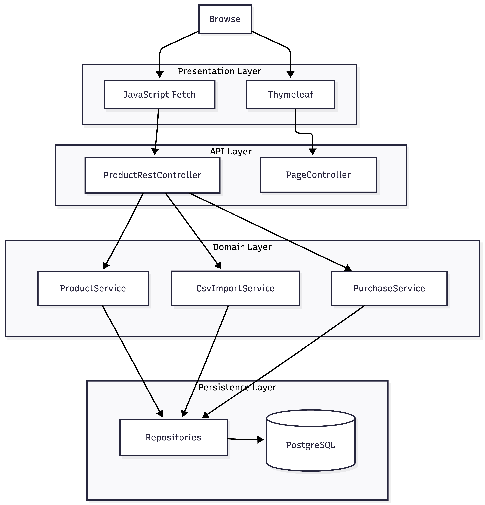
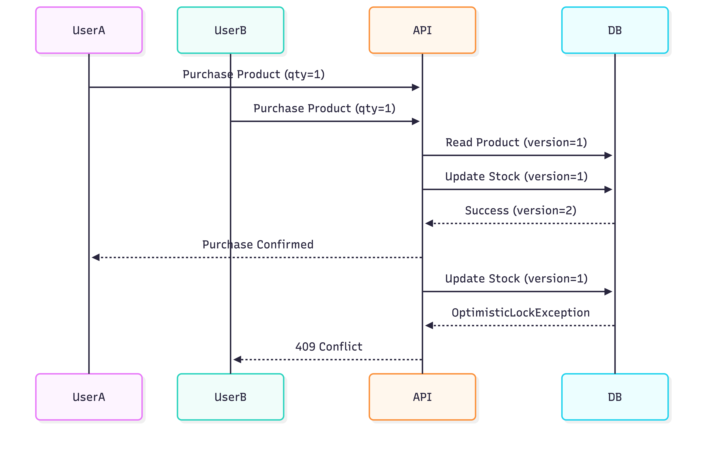
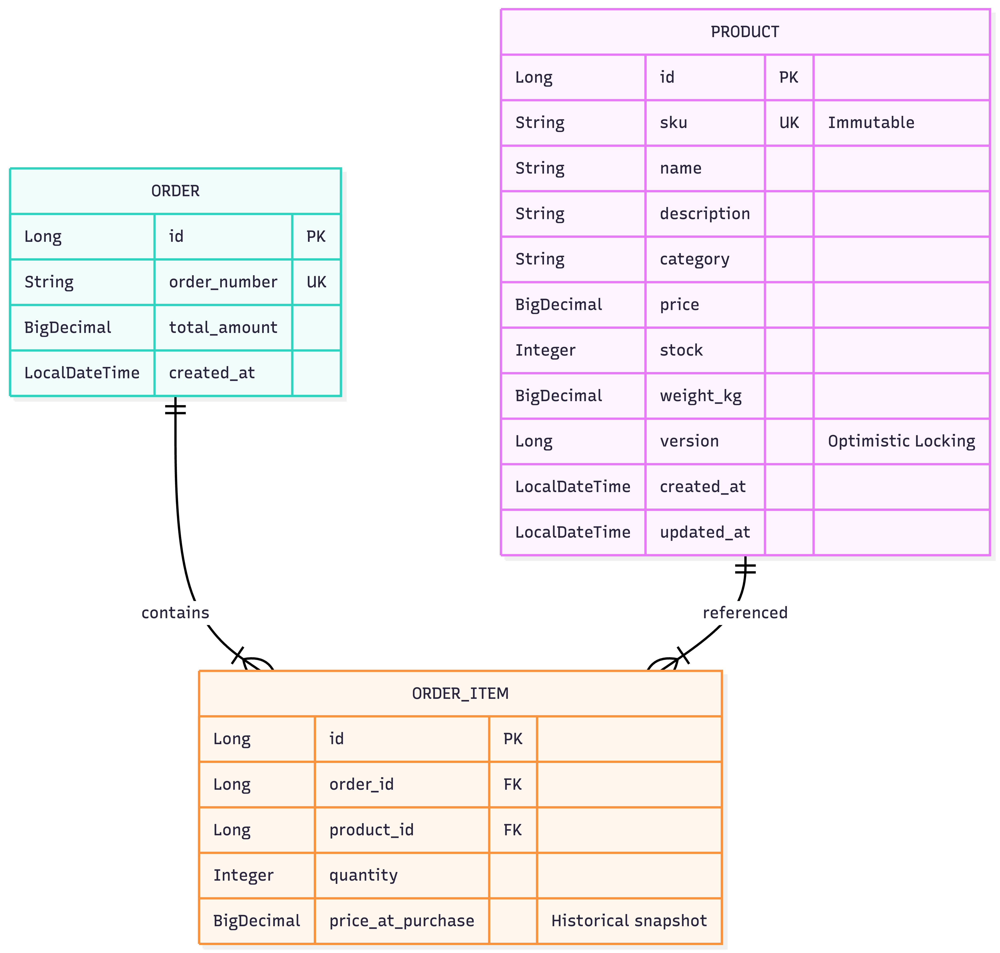
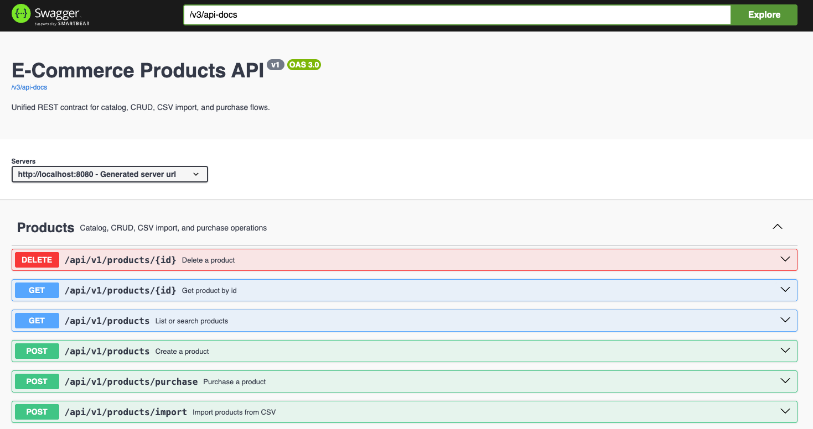
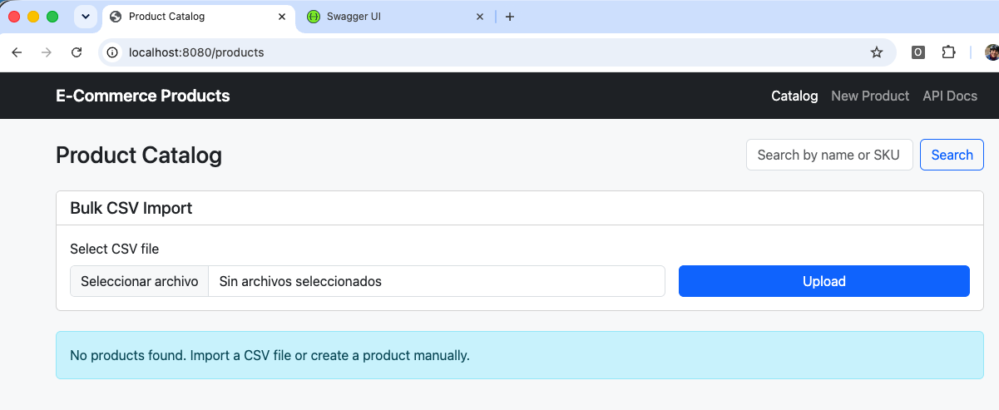
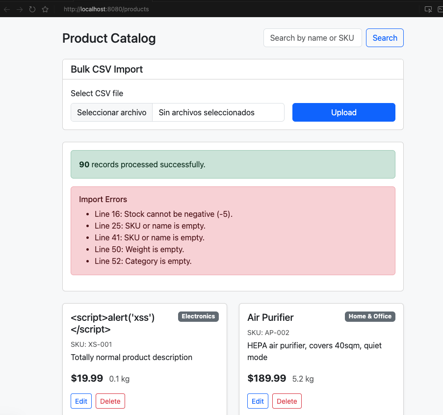
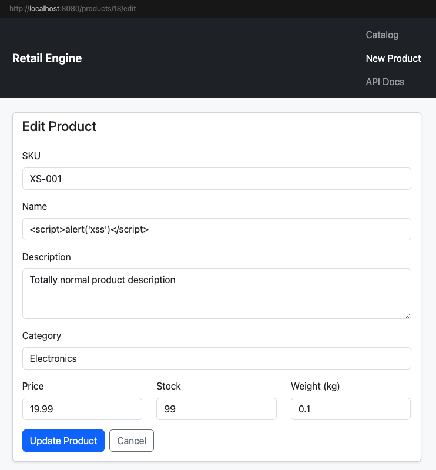
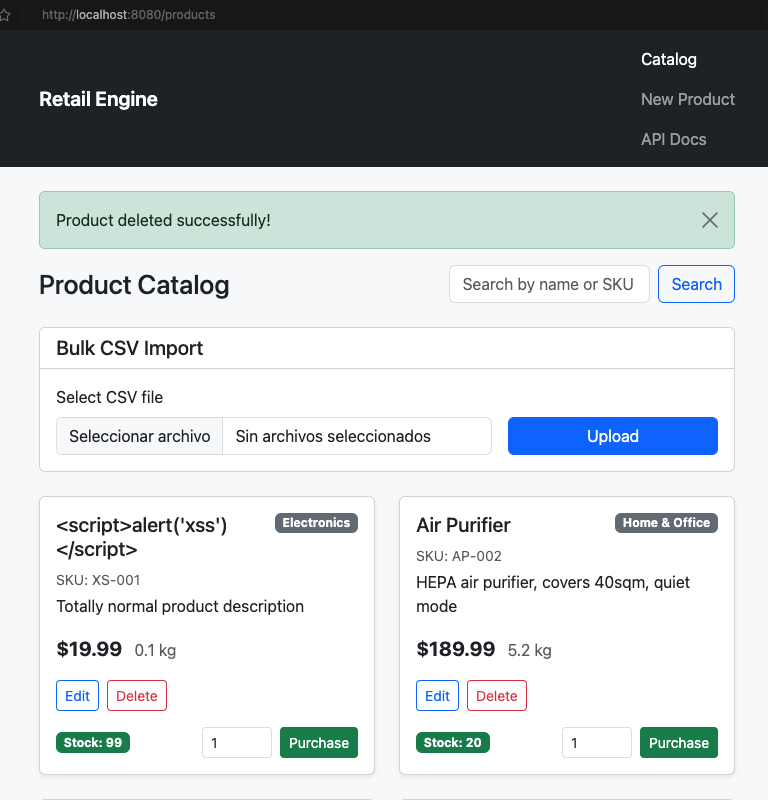
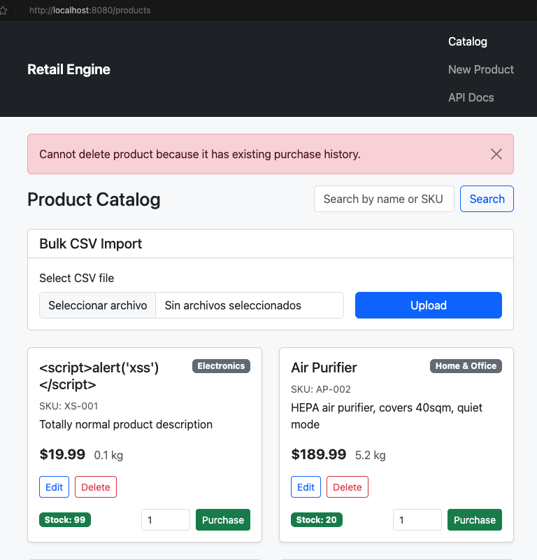

# Retail Engine

## Table of Contents

- [Executive Summary](#executive-summary)
- [Sample Data](#sample-data)
- [Architecture Overview](#architecture-overview)
- [Concurrent Purchase Flow (Pessimistic Locking)](#concurrent-purchase-flow)
- [Domain Model](#domain-model)
- [REST API Contract](#rest-api)
- [UI Pages](#ui-pages)
- [Project Contents](#project-contents)
- [Architectural Decisions and Technical Stack](#architectural-decisions)
- [Features](#features)
- [Future Enhancements](#future-enhancements)
- [Test Suite](#test-suite)
- [Local Setup and Execution Guide](#local-setup)
- [Application Tour](#application-tour)
- [Running Tests](#running-tests)

---

<a id="executive-summary"></a>
## Executive Summary

A production-minded e-commerce product catalog built on the Java ecosystem. The application delivers full product CRUD, 
live search, a transaction-safe purchase flow, resilient CSV bulk import, and a containerized deployment — all behind a 
unified REST API with a lightweight Thymeleaf + `fetch` frontend with:

- Java 21
- Spring Boot 3
- PostgreSQL
- Docker
- OpenAPI / Swagger
- Pessimistic Locking (checkout)
- CSV Bulk Import

**Features:**

- Product CRUD
- Product Search
- CSV Import
- Simulated Checkout
- Automated Testing (56 tests)

Designed with a **REST-first architecture** and production-oriented concerns such as idempotent imports, inventory concurrency control via pessimistic row locking at checkout, and isolated test execution (H2 in-memory for `./mvnw test`, PostgreSQL in Docker for runtime).

---

<a id="sample-data"></a>
## Sample Data

The repository includes a realistic product catalog CSV with intentional edge cases (negative stock, blank fields, duplicate SKUs) to exercise the import pipeline:

* **Provided CSV File Download Date/Time:** Friday, June 19, 2026, at 1:09 PM.
* **Root copy:** `sample-products.csv`
* **Test fixture:** `src/test/resources/sample-products.csv`

Use either file when trying bulk import from the UI or when running the integration tests.

---

<a id="architecture-overview"></a>
## Architecture Overview

The application follows a **single REST API + thin presentation layer** pattern:



| Layer | Responsibility |
|-------|----------------|
| `ProductRestController` (`/api/v1/products`) | Unified JSON API: catalog, CRUD, CSV import, purchase |
| `PageController` | Serves static Thymeleaf HTML shells only (no business logic) |
| Thymeleaf + `fetch` | Client-side presentation that consumes the REST API asynchronously |
| Swagger UI (`/swagger-ui.html`) | Interactive OpenAPI documentation for the full API contract |

---

<a id="concurrent-purchase-flow"></a>
## Concurrent Purchase Flow (Pessimistic Locking)

When two clients attempt to purchase the last unit of stock simultaneously, the checkout path acquires a **pessimistic write lock** on the product row (`findByIdForUpdate` → `SELECT … FOR UPDATE`). Concurrent purchase attempts on the same product are serialized at the database level until the active transaction completes, preventing overselling without relying on client retries. The `@Version` field remains on `Product` as an entity-level safeguard for other update paths.



* **The problem:** Two users hit **Purchase** at the same millisecond for a product with only one unit left.
* **The solution:** Stock decrement runs inside a transaction after acquiring a row-level write lock (`SELECT … FOR UPDATE`). A concurrent checkout on the same product waits until the lock is released; it then completes successfully or fails with **insufficient stock** if the prior transaction consumed the remaining units — no overselling, no client retry loop for version conflicts.

---

<a id="domain-model"></a>
## Domain Model



| Entity | Purpose |
|--------|---------|
| **Product** | Catalog item available for search, import, update, and purchase. |
| **Order** | Represents a completed purchase transaction. |
| **OrderItem** | Snapshot of purchased products and prices at checkout time. |

### Domain Design

Although payments are simulated, purchases are persisted through an **Order / OrderItem** model.

This preserves transactional history, allows auditability, and establishes a foundation for future features such as order history, refunds, invoicing, and payment gateway integration.

---

<a id="rest-api"></a>
## REST API Contract (`/api/v1/products`)

All business operations are exposed through a single versioned controller. The UI, Swagger UI, and any external client consume the same JSON contract.

| Method | Path | Purpose | Request / Response |
|--------|------|---------|-------------------|
| `GET` | `/api/v1/products` | List or search the catalog | Optional query `?search=` (name or SKU, case-insensitive partial match), `?page=` (default `0`), `?size=` (default `12`, max `100`). Returns a Spring Data `Page` JSON payload (`content`, `totalElements`, `totalPages`, etc.). |
| `GET` | `/api/v1/products/{id}` | Retrieve a single product by primary key | Returns `Product` JSON. `404` if not found. |
| `POST` | `/api/v1/products` | Create a new product | JSON body (`ProductRequest`). Returns `201 Created` with the persisted entity. |
| `PUT` | `/api/v1/products/{id}` | Update product metadata in place | JSON body (`ProductRequest`). Updates name, description, category, price, stock, and weight. The edit UI treats **SKU as immutable** (read-only field) to preserve catalog identity across integrations. |
| `DELETE` | `/api/v1/products/{id}` | Remove a product from the catalog | Returns a success message. `404` if not found. `409` if the product has existing purchase history in `order_items`. |
| `POST` | `/api/v1/products/import` | Bulk CSV ingestion pipeline | `multipart/form-data` with a `file` field. Returns processed count and line-level errors. Upserts by SKU. |
| `POST` | `/api/v1/products/purchase` | Simulated checkout / stock decrement | JSON body `{ "productId": number, "quantity": number }`. Returns order confirmation or `409 Conflict` when stock is insufficient. |

**Interactive documentation:** http://localhost:8080/swagger-ui.html



<a id="ui-pages"></a>
## UI Pages (presentation shells)

| Path | Purpose |
|------|---------|
| `GET /products` | Catalog page — loads data via `fetch` from the API |
| `GET /products/new` | Create form — submits via `POST /api/v1/products` |
| `GET /products/{id}/edit` | Edit form — loads via `GET`, saves via `PUT` |

---

<a id="project-contents"></a>
## Project Contents

| Path | Purpose |
|------|---------|
| `pom.xml` | Maven build definition: Spring Boot 3.3, Java 21, JPA, Thymeleaf, Validation, PostgreSQL, Apache Commons CSV |
| `Dockerfile` | Multi-stage image build (JDK 21 → JRE 21) producing a runnable Spring Boot JAR |
| `docker-compose.yml` | Orchestrates PostgreSQL (with healthcheck) and the application on a shared network |
| `docs/diagrams/` | Architecture diagrams, UI screenshots, and Swagger UI reference images for this README |
| `mvnw` / `mvnw.cmd` | Maven Wrapper to build and test without a global Maven installation |
| `src/main/java/com/retail/engine/` | Application source (`controller`, `dto`, `service`, `model`, `repository`, `config`) |
| `src/main/resources/static/js/api.js` | Shared fetch helpers for the UI client |
| `src/main/resources/templates/products/` | Thymeleaf HTML shells (catalog, form) — Bootstrap 5 via CDN |
| `src/test/java/com/retail/engine/` | Automated test suite (service, web, persistence, and integration tests) |
| `src/test/resources/sample-products.csv` | Sample catalog CSV used by integration tests |

---

<a id="architectural-decisions"></a>
## Architectural Decisions and Technical Stack

### 1. Core Stack

* **Backend:** **Java 21** + **Spring Boot 3.x**
    * *Decision:* Chosen for maximum reliability, strong typing, and industry-standard dependency injection. Virtual Threads (Project Loom) are enabled to process blocking I/O tasks efficiently.

#### Why Java 21 instead of Java 25?

Although Java 25 is available, this project intentionally targets **Java 21 LTS** as its compile and runtime baseline (`pom.xml`, `Dockerfile`):

| Factor | Java 21 | Java 25 |
|--------|---------|---------|
| **Ecosystem maturity** | Two years of production use since its LTS release (September 2023). Spring Boot 3.3, Hibernate, Mockito, and SpringDoc are fully validated against it. | Newer release; libraries and build plugins often lag behind the latest JDK by several months. |
| **Spring Boot alignment** | First-class supported version for Spring Boot 3.3.x — the version this application uses. | Supported in newer Spring Boot lines, but not the baseline this stack was built and tested on. |
| **Docker reproducibility** | `eclipse-temurin:21` images are widely available and stable in CI/CD pipelines. | JDK 25 base images exist, but are less common in production deployments today. |
| **Testing toolchain** | Mockito + Byte Buddy mock concrete classes and interfaces without extra flags. | Running the test suite on JDK 25 required workarounds (e.g. extracting service interfaces) because Mockito cannot reliably mock concrete classes on the newest bytecode yet. |
| **Features needed** | Virtual Threads, records, pattern matching, and sequenced collections — all capabilities this application relies on are already present. | No Java 25-specific feature is needed here; upgrading would add risk without functional gain. |

**Summary:** Java 21 delivers the modern concurrency model (Virtual Threads) and language features this app needs, while maximizing stability for Docker deployments, dependency compatibility, and a friction-free `./mvnw test` experience. The bytecode target remains 21 even if a developer runs Maven with a newer JDK locally.

* **Database:** **PostgreSQL**
    * *Decision:* True enterprise applications require absolute consistency for commercial numbers, transactions, and inventories. Relational PostgreSQL ensures ACID compliance, preventing financial or inventory anomalies.
    * *Alternatives considered:* NoSQL was evaluated for schema flexibility, but the fixed tabular CSV structure and transaction-safe purchase flow require ACID guarantees. PostgreSQL plus pessimistic row locking at checkout was selected to prevent inventory race conditions without client-side retry loops.
* **User Interface:** **Thymeleaf shells + Bootstrap 5 (CDN) + native `fetch`**
    * *Decision:* Thymeleaf renders lightweight HTML pages with no server-side business state. All data flows through the unified REST API, eliminating duplicated controller logic.

#### Why Thymeleaf as a decoupled presentation shell?

This is a deliberate **REST-first hybrid architecture** — also described as an **SPA approach with SSR**: the server delivers the initial HTML shell (Server-Side Rendering), while every dynamic operation runs in the browser through asynchronous JSON calls to `ProductRestController`.

In enterprise architecture reviews, this pattern is formally known as **Layer Decoupling within a Monolith**: the monolith ships as one deployable unit, but internal boundaries behave like a microservice-style API surface.

| Layer | Role | Technology |
|-------|------|------------|
| **Presentation** | HTML layout, navigation, forms, client-side rendering | Thymeleaf shells + Bootstrap + `fetch` |
| **API contract** | Business operations exposed as JSON | `ProductRestController` (`/api/v1/products`) |
| **Domain & persistence** | Rules, transactions, data access | Services + JPA + PostgreSQL |

* **Frontend Engineering Efficiency & Operational Simplicity:**

The project consciously avoids introducing a dedicated Node.js-based Single Page Application (SPA) framework (such as React, Angular, or Vue) to align with the core catalog and ingestion scope of this architecture. This decision represents a deliberate engineering trade-off: by leveraging native browser capabilities (`fetch()`) and lightweight Thymeleaf shells, the application eliminates the compilation overhead, supply-chain dependency risks, and deployment complexity typical of modern frontend toolchains. This approach prioritizes engineering effort toward backend transaction integrity, API contract design, and ingestion resilience while keeping the presentation layer intentionally lightweight.

**Benefits of the hybrid client**

* **No duplicated controller logic** — CRUD, search, import, and purchase exist once in the REST layer; Thymeleaf pages never re-implement them.
* **Clear separation of concerns** — `PageController` only maps URLs to static templates; the API owns all state mutations and validation responses.
* **Progressive enhancement** — pages are real URLs (`/products`, `/products/new`) with SSR shells for fast first paint; interactivity is added client-side via native `fetch` without a heavy JS framework.
* **Documented contract** — Swagger UI exposes the full API for any consumer beyond the built-in UI.

* **API Documentation:** **SpringDoc OpenAPI 3 + Swagger UI**
    * *Decision:* A single documented contract at `/swagger-ui.html` serves API consumers, frontend clients, and external integrations.

### 2. High-Concurrency Strategy (Race Conditions on Purchase)

See the [Concurrent Purchase Flow (Pessimistic Locking)](#concurrent-purchase-flow) diagram for the end-to-end sequence. The checkout path acquires a **pessimistic write lock** on read (`findByIdForUpdate`) so concurrent purchase attempts on the same product are serialized at the database level. The `@Version` column on `Product` remains as an entity-level safeguard for non-checkout updates.

### 3. Catalog Search and Pagination

* **Partial search:** The repository uses escaped `LIKE '%term%'` queries (`ESCAPE '\\'`) so user-supplied `%` and `_` characters are matched literally rather than as SQL wildcards.
* **Production scaling:** At high volume, leading-wildcard `LIKE` patterns bypass standard B-Tree indexes in PostgreSQL. A production rollout would migrate search to **`pg_trgm` trigram indexes** or **Full-Text Search**, while keeping prefix search (`StartingWith` → `LIKE 'term%'`) where index-friendly lookups are enough.
* **Pagination:** The catalog API returns a paginated `Page<Product>` (default `size=12`) so the UI never loads an unbounded product list into memory.

### 4. Resilient Ingestion Pipeline (Data Cleansing and Security)

The ingestion service (`DefaultCsvImportService`) utilizes **Apache Commons CSV** and delegates each valid row to `DefaultCsvImportRowWriter` under a strict defensive pipeline:

* **Upsert Idempotency:** If an imported SKU already exists in the database, it behaves as an *Update* instead of duplicating data.
* **Per-row transactions:** Each persisted row runs in `@Transactional(propagation = REQUIRES_NEW)` so a database failure on one line cannot roll back previously committed valid rows.
* **Data Cleansing:** Removes currency symbols (`$29.99` → `29.99`), interprets `"free"` as zero price, and ignores blank rows.
* **Partial Fault Tolerance:** Invalid rows are skipped with line-level error reporting; valid rows continue processing.
* **XSS and SQL Injection Defense:** Parameterized JPA queries, JSON API responses, and client-side `escapeHtml()` when rendering catalog cards mitigate injection vectors from dirty CSV data.

---

<a id="features"></a>
## Features

| Capability | Implementation |
|------------|----------------|
| Local SQL database | PostgreSQL via Docker Compose |
| Product CRUD | JSON REST API + Thymeleaf/`fetch` UI client |
| CSV bulk import | Defensive upsert pipeline with line-level error reporting |
| Product search | Case-insensitive partial filter by name or SKU with paginated API responses |
| Simulated purchase | Pessimistic row lock at checkout (`findByIdForUpdate`), persisted `Order` / `OrderItem` |
| Docker deployment | Multi-stage `Dockerfile` + `docker-compose.yml` |
| API documentation | SpringDoc OpenAPI + Swagger UI |
| Automated tests | 56 tests across eight test classes (service, web, persistence, and integration) |

<a id="future-enhancements"></a>
## Future Enhancements

The current version is intentionally focused on catalog, import, and inventory integrity. The following items are natural next steps rather than gaps:

| Area | Rationale |
|------|-----------|
| **Real payment gateway** (Stripe, PayPal, etc.) | Orders are persisted internally to prove transactional integrity. A payment provider would be added when moving beyond simulated checkout. |
| **User authentication / authorization** | Endpoints are open in v1 to keep the focus on product and inventory logic. Login, roles, or JWT would be the first security layer in a production rollout. |
| **Order history UI** | Orders are stored for audit and purchase proof; a customer-facing order list can be built on the existing persistence layer. |
| **Shopping cart / multi-item checkout** | Purchase is single-product per action today — enough to demonstrate stock control and concurrency handling. |
| **Full SPA frontend** (React, Angular, etc.) | The REST API is ready for a dedicated frontend; Thymeleaf shells + `fetch` keep v1 simple without a JS build chain. |
| **Category enum enforcement** | Categories vary widely in real data (`Food & Beverage`, `Home & Office`, etc.). A flexible `String` field handles imports better than a rigid enum. |
| **Order number generation in clustered deployments** | Checkout uses an in-memory `AtomicLong` sequence (`ORD-YYYYMMDD-###`), which resets on restart and is not shared across containers. Production would move to a database sequence, UUID, or distributed counter while keeping the unique `order_number` constraint. |
| **Indexed catalog search (`pg_trgm` / FTS)** | Partial search today uses `LIKE '%term%'`, which does not scale on large PostgreSQL catalogs. Trigram indexes (`pg_trgm`) or Full-Text Search would preserve substring UX without sequential scans. |
| **Email notifications, webhooks, or async messaging** | Post-purchase communication can be layered on once the core flow is stable. |
| **Cloud deployment** (K8s, AWS, etc.) | Docker Compose covers local and single-host deployment; cloud infra is an operational next step. |
| **Load / stress tests** | Pessimistic checkout locking is covered by unit and integration tests; dedicated concurrency benchmarks can follow in a hardening phase. |

---

<a id="test-suite"></a>
## Test Suite

The project includes **56 automated tests** across eight test classes covering the service, web, persistence, and integration layers. Run them with:

```bash
./mvnw test
```

Tests use **JUnit 5**, **Mockito**, **Spring Boot Test**, and an in-memory **H2** database for JPA slice tests.

**Test vs. production database:** Production runs on **PostgreSQL** (Docker Compose). Tests never connect to it. Spring Boot loads `src/test/resources/application.properties` during `./mvnw test`, which overrides the main datasource with an embedded H2 driver (`jdbc:h2:mem:testdb`). Service and web slice tests use mocks or `@WebMvcTest` and require no database at all — so the full suite runs immediately without Docker.

### 1. Service Layer — `CsvImportServiceTest` (16 tests)

Validates CSV parsing, validation, and row-level error reporting. Persistence is delegated to `CsvImportRowWriter` (mocked).

| Scenario | Objective |
|----------|-----------|
| Valid product import | Happy path with correct `BigDecimal` / `Integer` mapping |
| Currency symbol stripping | `$29.99` parsed as `29.99` |
| Free price handling | `"free"` and `"FREE"` → `BigDecimal.ZERO` |
| Negative stock row | Error recorded; remaining valid rows still processed |
| Upsert by SKU | Existing product updated in place |
| Blank rows | Completely empty rows silently skipped |
| Header-only CSV | Zero records processed, no crash |
| Empty SKU or name | Line error recorded, row skipped |
| Negative weight | Line error recorded |
| Invalid price / stock format | Line error recorded with field-specific format message |
| Duplicate SKU in same file | Second row overwrites first within the batch |
| Row writer failure isolation | A DB failure on one row is reported without aborting subsequent valid rows |
| Empty file | Zero records processed without crashing |
| Unreadable file | I/O failure wrapped in `RuntimeException` |

### 2. Service Layer — `CsvImportRowWriterTest` (2 tests)

Validates per-row upsert persistence (mocked repository).

| Scenario | Objective |
|----------|-----------|
| Insert new SKU | Creates and flushes a new `Product` row |
| Upsert existing SKU | Updates the existing entity in place by SKU |

### 3. Service Layer — `DefaultPurchaseServiceTest` (7 tests)

Validates the transactional purchase flow and order creation (mocked repositories).

| Scenario | Objective |
|----------|-----------|
| Successful purchase | Stock decremented under pessimistic lock; `Order` + `OrderItem` created with frozen price |
| Quantity equals stock | Boundary case: stock reaches exactly zero |
| Product not found | `PurchaseException` before any persistence |
| Insufficient stock | Rejected when `quantity > stock` |
| Invalid quantity | `null`, zero, or negative quantity rejected |

### 4. Service Layer — `DefaultProductServiceTest` (7 tests)

Validates paginated catalog search orchestration and SKU immutability (mocked repository).

| Scenario | Objective |
|----------|-----------|
| Blank search | Returns a paginated `findAll` result with default page size |
| Term search | Delegates escaped partial match query with trimmed term and pageable |
| LIKE wildcard escape | `%`, `_`, and `\` in search terms are escaped before binding |
| Invalid page/size | Clamps negative page to `0` and oversized page size to max `100` |
| SKU immutability on update | `PUT` updates mutable fields but preserves the existing SKU |
| Delete with purchase history | `409 Conflict` when `order_items` reference the product |
| Delete without history | Product removed when no purchase records exist |

### 5. Web Layer — `ProductRestControllerTest` (11 tests)

Validates the unified JSON API via `@WebMvcTest` + `MockMvc`.

| Scenario | Objective |
|----------|-----------|
| List/search | `GET /api/v1/products` returns paginated JSON (`content`, `totalElements`, …) |
| Pagination params | Explicit `page` / `size` query params forwarded to the service |
| Get by id | `GET /api/v1/products/{id}` |
| Create | `POST` → 201 Created |
| Validation error | `POST` with invalid body → 400 + field errors |
| Update | `PUT /api/v1/products/{id}` |
| Delete success | `DELETE` → success message |
| Delete blocked | `DELETE` → `409` when purchase history exists |
| CSV import | `POST /import` multipart |
| Purchase success | `POST /purchase` → 200 |
| Insufficient stock on purchase | `POST /purchase` → `409 Conflict` with business error message |

### 6. Web Layer — `PageControllerTest` (4 tests)

Validates Thymeleaf shell pages contain no business logic.

| Scenario | Objective |
|----------|-----------|
| Root redirect | `GET /` → `/products` |
| Catalog shell | Renders `products/catalog` |
| Create form shell | Renders `products/form` |
| Edit form shell | Renders `products/form` |

### 7. Persistence Layer — `ProductRepositoryTest` (7 tests)

Validates JPA mapping and repository queries against in-memory H2 via `@DataJpaTest`.

| Scenario | Objective |
|----------|-----------|
| Timestamps on persist | `@PrePersist` sets `createdAt` / `updatedAt` |
| Updated timestamp on modify | `@PreUpdate` advances `updatedAt` on each successful update |
| Search by name or SKU | Case-insensitive partial match query works |
| Paginated search | `Pageable` limits result size and exposes total element count |
| LIKE wildcard literals | Escaped patterns treat `%` and `_` as literal characters |
| Version increment | `@Version` field increments on each successful update |
| Find by SKU | Unique SKU lookup returns correct product |

> **Note:** Checkout concurrency is enforced via `findByIdForUpdate` (pessimistic write lock). The `@Version` column on `Product` remains for other update paths. Dedicated multi-threaded stress tests are planned as a future hardening step.

### 8. Integration — `SampleProductsCsvImportTest` (2 tests)

Imports **`sample-products.csv`** against a real H2 database (not mocks).

| Scenario | Objective |
|----------|-----------|
| Full file import | 90 rows processed, 5 line errors (lines 16, 25, 41, 50, 52), 87 unique SKUs persisted |
| Duplicate SKU upsert | `RS-001` and `BS-021` retain values from their last CSV occurrence |

Known invalid rows in the sample file:

| Line | Issue |
|------|-------|
| 16 | Negative stock (`-5`) |
| 25 | Empty product name |
| 41 | Whitespace-only product name |
| 50 | Empty weight |
| 52 | Empty category (Gift Card row) |

---

<a id="local-setup"></a>
## Local Setup and Execution Guide

### Prerequisites

* Docker and Docker Compose installed locally.
* *(Optional)* A CSV file with product rows to exercise the bulk import pipeline. The repo root includes `sample-products.csv` — a catalog with realistic edge cases (duplicate SKUs, negative stock, blank fields) useful for manual testing. The same fixture drives the integration test suite.

### Running the Infrastructure

The application is fully containerized. You do not need Java, Maven, or PostgreSQL installed on your host machine.

1. Clone this repository.
2. Launch the complete application stack:

   ```bash
   docker-compose up --build
   ```

3. The compose setup will launch:
    * **PostgreSQL** on port `5432` (database: `retail_engine`, user: `retail_engine`)
    * **Spring Boot app** on port `8080` (container: `retail-engine-app`)

   > If you previously ran the stack under the old database name, reset volumes first: `docker-compose down -v`

4. Open your browser and navigate to:
    * **Catalog UI:** http://localhost:8080/products
    * **Swagger UI:** http://localhost:8080/swagger-ui.html

<a id="application-tour"></a>
## Application Tour

The catalog experience is **REST-first and asynchronous**: the browser never posts traditional form actions to MVC endpoints. Instead, `api.js` sends JSON payloads to `ProductRestController` and re-renders the DOM from the response — no full-page reload on search, import, purchase, or delete.



### Step 1: Bulk CSV Import

1. On the catalog page (`/products`), open the **Bulk CSV Import** card.
2. Select any product CSV (e.g. `sample-products.csv`) and click **Upload**.
3. The client posts `multipart/form-data` to `POST /api/v1/products/import`. An inline result card renders the JSON response (processed count + line errors), then the grid reloads via `GET /api/v1/products` — all without leaving the page.



### Step 2: Search and Catalog

1. On load, the catalog fetches `GET /api/v1/products?page=0&size=12` and builds the card grid from the paginated JSON payload (`content` array).
2. Enter a search term and submit — the client calls `GET /api/v1/products?search=…&page=0&size=12` and replaces the grid in place, resetting to the first page.
3. When results span multiple pages, **Previous** / **Next** controls request additional pages without reloading the shell.
4. Matching is case-insensitive partial text on name or SKU, handled entirely by the API layer.


### Step 3: Purchase Flow

1. Each card exposes a quantity input and a **Purchase** button (disabled when stock is zero).
2. Clicking **Purchase** sends `POST /api/v1/products/purchase` with `{ productId, quantity }`.
3. On `200 OK`, a dismissible alert renders the JSON message and the grid refreshes from the API so stock badges reflect the new state.
4. On insufficient stock, the error payload surfaces as an alert — inventory is never mutated client-side.

### Step 4: Product Management (CRUD)

1. **Create:** the form at `/products/new` submits `POST /api/v1/products` with a JSON body. Validation errors (`400`) map field-by-field from the API response.
2. **Read / Update:** the edit shell at `/products/{id}/edit` loads the entity via `GET /api/v1/products/{id}` and persists changes with `PUT /api/v1/products/{id}` (SKU field read-only).



3. **Delete:** each catalog card triggers `DELETE /api/v1/products/{id}` after confirmation, then reloads the grid asynchronously. Products with purchase history are protected and return `409 Conflict` with a clear inline alert.





4. After a successful create, the client navigates to `/products` where the new item is immediately visible via the standard catalog fetch.

---

<a id="running-tests"></a>
## Running Tests

```bash
./mvnw test
```

Expected output: **56 tests, 0 failures**.
