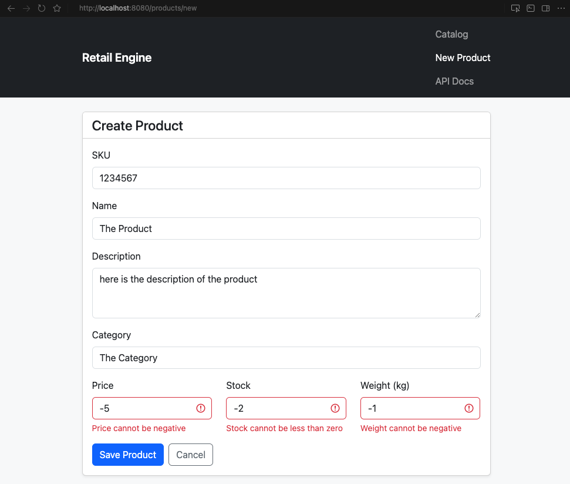

# Retail Engine

## Table of Contents

- [Executive Summary](#executive-summary)
- [Sample Data](#sample-data)
- [Architecture Overview](#architecture-overview)
- [Concurrent Purchase Flow (Pessimistic Locking)](#concurrent-purchase-flow)
- [Domain Model](#domain-model)
- [REST API Contract](#rest-api)
- [UI Pages](#ui-pages)
- [Project Contents](#project-contents)
- [Architectural Decisions and Technical Stack](#architectural-decisions)
- [Features](#features)
- [Future Enhancements](#future-enhancements)
  - [Strategic refactors](#strategic-refactors)
- [Test Suite](#test-suite)
- [Local Setup and Execution Guide](#local-setup)
- [Application Tour](#application-tour)
- [Running Tests](#running-tests)

---

<a id="executive-summary"></a>
## Executive Summary

A production-minded product catalog on Java 21, Spring Boot 3, and PostgreSQL. Full CRUD, search, CSV import, and transaction-safe checkout behind a unified REST API, with Thymeleaf + `fetch` for the UI.

- Java 21 · Spring Boot 3 · PostgreSQL · Docker · OpenAPI
- Pessimistic locking at checkout · Resilient CSV import · 61 automated tests

REST-first design: idempotent imports, row-level stock locking, H2 for `./mvnw test`, PostgreSQL in Docker at runtime.

---

<a id="sample-data"></a>
## Sample Data

Repo includes `sample-products.csv` with edge cases (negative stock, blanks, duplicate SKUs):

* **Provided CSV File Download Date/Time:** Friday, June 19, 2026, at 1:09 PM.
* **Root:** `sample-products.csv`
* **Tests:** `src/test/resources/sample-products.csv`

---

<a id="architecture-overview"></a>
## Architecture Overview

The application follows a **single REST API + thin presentation layer** pattern:


| Layer | Responsibility |
|-------|----------------|
| `ProductRestController` (`/api/v1/products`) | Unified JSON API: catalog, CRUD, CSV import, purchase |
| `PageController` | Serves static Thymeleaf HTML shells only (no business logic) |
| Thymeleaf + `fetch` | Client-side presentation that consumes the REST API asynchronously |
| Swagger UI (`/swagger-ui.html`) | Interactive OpenAPI documentation for the full API contract |

---

<a id="concurrent-purchase-flow"></a>
## Concurrent Purchase Flow (Pessimistic Locking)

When two clients buy the last unit at once, checkout locks the product row (`findByIdForUpdate` → `SELECT … FOR UPDATE`). Concurrent attempts serialize at the DB; `@Version` on `Product` is a fallback for other updates.


* **Problem:** two clients purchase the last unit at once.
* **Solution:** `SELECT … FOR UPDATE` inside a transaction — concurrent checkouts serialize; the second succeeds or gets insufficient stock.

---

<a id="domain-model"></a>
## Domain Model


| Entity | Purpose |
|--------|---------|
| **Product** | Catalog item available for search, import, update, and purchase. |
| **Order** | Represents a completed purchase transaction. |
| **OrderItem** | Snapshot of purchased products and prices at checkout time. |

### Domain Design

Payments are simulated, but each purchase creates an **Order** with **OrderItem** snapshots (product, quantity, price at checkout). That gives audit history and a base for order lists, refunds, or a real payment gateway later.

---

<a id="rest-api"></a>
## REST API Contract (`/api/v1/products`)

All business operations are exposed through a single versioned controller. The UI, Swagger UI, and any external client consume the same JSON contract.

| Method | Path | Purpose | Request / Response |
|--------|------|---------|-------------------|
| `GET` | `/api/v1/products` | List or search the catalog | Optional query `?search=` (name or SKU, case-insensitive partial match), `?page=` (default `0`), `?size=` (default `12`, max `100`). Returns a Spring Data `Page` JSON payload (`content`, `totalElements`, `totalPages`, etc.). |
| `GET` | `/api/v1/products/{id}` | Retrieve a single product by primary key | Returns `Product` JSON. `404` if not found. |
| `POST` | `/api/v1/products` | Create a new product | JSON body (`ProductRequest`). Returns `201 Created` with the persisted entity. `409` if the SKU already exists. |
| `PUT` | `/api/v1/products/{id}` | Update product metadata in place | JSON body (`UpdateProductRequest` — no `sku` field). Updates name, description, category, price, stock, and weight. SKU is immutable after creation. |
| `DELETE` | `/api/v1/products/{id}` | Remove a product from the catalog | Returns a success message. `404` if not found. `409` if the product has existing purchase history in `order_items`. |
| `POST` | `/api/v1/products/import` | Bulk CSV ingestion pipeline | `multipart/form-data` with a `file` field (max **10 MB**, must not be empty). Returns processed count and line-level errors. Upserts by SKU. `400` if the file is missing or empty; `422` if the file cannot be read. |
| `POST` | `/api/v1/products/purchase` | Simulated checkout / stock decrement | JSON body `{ "productId": number, "quantity": number }`. Returns order confirmation, `404` when the product does not exist, or `409 Conflict` when stock is insufficient or quantity is invalid. |

**Interactive documentation:** http://localhost:8080/swagger-ui.html


<a id="ui-pages"></a>
## UI Pages (presentation shells)

| Path | Purpose |
|------|---------|
| `GET /products` | Catalog page — loads data via `fetch` from the API |
| `GET /products/new` | Create form — submits via `POST /api/v1/products` |
| `GET /products/{id}/edit` | Edit form — loads via `GET`, saves via `PUT` |

---

<a id="project-contents"></a>
## Project Contents

| Path | Purpose |
|------|---------|
| `pom.xml` | Maven build definition: Spring Boot 3.3, Java 21, JPA, Thymeleaf, Validation, PostgreSQL, Apache Commons CSV |
| `Dockerfile` | Multi-stage image build (JDK 21 → JRE 21) with `./mvnw package` (tests run during image build) |
| `docker-compose.yml` | Orchestrates PostgreSQL (with healthcheck) and the application (with Actuator healthcheck) on a shared network |
| `docs/diagrams/` | Architecture diagrams, UI screenshots, and Swagger UI reference images for this README |
| `mvnw` / `mvnw.cmd` | Maven Wrapper to build and test without a global Maven installation |
| `src/main/java/com/retail/engine/` | Application source (`controller`, `dto`, `service`, `model`, `repository`, `config`, `exception`) |
| `src/main/resources/static/js/api.js` | Shared fetch helpers for the UI client |
| `src/main/resources/templates/products/` | Thymeleaf HTML shells (catalog, form) sharing `fragments/layout.html` — Bootstrap 5 via CDN |
| `src/test/java/com/retail/engine/` | Automated test suite (service, web, persistence, and integration tests) |
| `src/test/resources/sample-products.csv` | Sample catalog CSV used by integration tests |

---

<a id="architectural-decisions"></a>
## Architectural Decisions and Technical Stack

### 1. Core Stack

* **Backend:** **Java 21** + **Spring Boot 3.x** — strong typing, mature ecosystem, Virtual Threads enabled for blocking I/O.

#### Why Java 21 instead of Java 25?

Although Java 25 is available, this project intentionally targets **Java 21 LTS** as its compile and runtime baseline (`pom.xml`, `Dockerfile`):

| Factor | Java 21 | Java 25 |
|--------|---------|---------|
| **Ecosystem maturity** | Two years of production use since its LTS release (September 2023). Spring Boot 3.3, Hibernate, Mockito, and SpringDoc are fully validated against it. | Newer release; libraries and build plugins often lag behind the latest JDK by several months. |
| **Spring Boot alignment** | First-class supported version for Spring Boot 3.3.x — the version this application uses. | Supported in newer Spring Boot lines, but not the baseline this stack was built and tested on. |
| **Docker reproducibility** | `eclipse-temurin:21` images are widely available and stable in CI/CD pipelines. | JDK 25 base images exist, but are less common in production deployments today. |
| **Testing toolchain** | Mockito + Byte Buddy mock concrete classes and interfaces without extra flags. | Running the test suite on JDK 25 required workarounds (e.g. extracting service interfaces) because Mockito cannot reliably mock concrete classes on the newest bytecode yet. |
| **Features needed** | Virtual Threads, records, pattern matching, and sequenced collections — all capabilities this application relies on are already present. | No Java 25-specific feature is needed here; upgrading would add risk without functional gain. |

**Summary:** Java 21 LTS balances modern features (Virtual Threads, records) with stable Spring Boot 3.3 and Docker support. Bytecode target stays 21 even if Maven runs on a newer JDK locally.

* **Database:** **PostgreSQL** — ACID transactions for inventory and orders. Pessimistic row locking at checkout prevents overselling without client retries.
* **User Interface:** **Thymeleaf shells + Bootstrap 5 (CDN) + `fetch`** — server renders HTML layout only; all data and mutations go through the REST API.

#### Why Thymeleaf instead of a SPA framework?

**REST-first hybrid:** the server delivers HTML shells (SSR first paint); the browser handles all dynamic work via `fetch` against `ProductRestController`. One deployable unit, API-shaped internal boundaries.

| Layer | Role | Technology |
|-------|------|------------|
| **Presentation** | Layout, navigation, client rendering | Thymeleaf + Bootstrap + `fetch` |
| **API** | Business operations as JSON | `ProductRestController` |
| **Domain** | Rules, transactions, persistence | Services + JPA + PostgreSQL |

No React/Angular/Vue build chain — scope is catalog and ingestion, not a rich client. CRUD, search, import, and purchase live once in the REST layer; `PageController` only maps URLs to templates. Swagger documents the contract for any future frontend swap.

* **API docs:** **SpringDoc OpenAPI 3 + Swagger UI** at `/swagger-ui.html`

### 2. High-Concurrency Strategy (Race Conditions on Purchase)

See [Concurrent Purchase Flow](#concurrent-purchase-flow). Checkout uses `findByIdForUpdate` — same product, same time, serialized at the DB. `@Version` covers non-checkout updates.

### 3. Catalog Search and Pagination

* **Partial search:** Escaped `LIKE '%term%'` (`ESCAPE '\\'`) — `%` and `_` in user input match literally.
* **Scaling:** Leading-wildcard `LIKE` won't use B-tree indexes; `pg_trgm` or FTS is the next step at volume.
* **Pagination:** `Page<Product>` with default `size=12`, max `100`.

### 4. CSV Ingestion Pipeline

`DefaultCsvImportService` + `DefaultCsvImportRowWriter`:

* **Upsert by SKU** — existing rows update in place.
* **Per-row `REQUIRES_NEW`** — one bad row doesn't roll back prior commits.
* **Cleansing** — strips `$`, treats `"free"` as zero, skips blank rows.
* **Line-level errors** — invalid rows reported; valid rows continue.
* **Upload cap** — 10 MB multipart limit at Tomcat.
* **Injection defense** — parameterized JPA, JSON responses, `escapeHtml()` in the catalog UI.

---

<a id="features"></a>
## Features

| Capability | Implementation |
|------------|----------------|
| Local SQL database | PostgreSQL via Docker Compose |
| Product CRUD | JSON REST API + Thymeleaf/`fetch` UI client |
| CSV bulk import | Defensive upsert pipeline with line-level error reporting |
| Product search | Case-insensitive partial filter by name or SKU with paginated API responses |
| Simulated purchase | Pessimistic row lock at checkout (`findByIdForUpdate`), persisted `Order` / `OrderItem` |
| Docker deployment | Multi-stage `Dockerfile` + `docker-compose.yml` |
| API documentation | SpringDoc OpenAPI + Swagger UI |
| Automated tests | 61 tests across eight test classes (service, web, persistence, and integration) |
| Health endpoint | Spring Boot Actuator at `/actuator/health` (used by Docker Compose healthcheck) |

<a id="future-enhancements"></a>
## Future Enhancements

### Product & operations

| Area | Notes |
|------|-------|
| **Payment gateway** (Stripe, PayPal) | Orders already persist; plug in a provider when checkout goes live. |
| **Order history UI** | `Order` / `OrderItem` tables are ready for a list view. |
| **Shopping cart** | Multi-item checkout on top of existing stock logic. |
| **Category enum** | `String` fits messy import data; normalize to enum if categories are controlled. |
| **Order numbers at scale** | Daily sequence from DB (`ORD-YYYYMMDD-###`); multi-replica needs a sequence or UUID. |
| **Search indexes** (`pg_trgm` / FTS) | Replace `LIKE '%term%'` sequential scans on large catalogs. |
| **Notifications** | Email, webhooks, or async messaging post-purchase. |
| **Cloud deploy** (K8s, AWS) | Beyond Docker Compose single-host. |
| **Load / stress tests** | Multi-threaded checkout benchmarks. |

<a id="strategic-refactors"></a>
### Strategic refactors

| Area | Notes |
|------|-------|
| **CI/CD** | `./mvnw test` → Docker build → registry push → staged deploy. |
| **MapStruct layer** | `ProductResponse` etc. — decouple API from JPA entities. |
| **Auth + rate limiting** | JWT or API keys, roles on mutations, limits on import/purchase. |
| **Flyway** | Versioned migrations, seeds, rollback plan — replace `ddl-auto=update`. |
| **Testcontainers** | Integration tests on PostgreSQL, not just H2. |
| **Batch CSV import** | Chunked transactions (50–100 rows) instead of one TX per row. |
| **Observability** | Micrometer, OpenTelemetry, structured logging. |
| **Dedicated frontend** | React/Angular/Vue when UI outgrows Thymeleaf; API won't need changes. |

---

<a id="test-suite"></a>
## Test Suite

The project has **61 tests** in eight classes. Run with `./mvnw test` — JUnit 5, Mockito, Spring Boot Test, H2 for JPA slices.

Tests use H2 (`src/test/resources/application.properties`); production uses PostgreSQL via Docker. Web and service slice tests use mocks and need no database.

### 1. Service Layer — `CsvImportServiceTest` (16 tests)

Validates CSV parsing and line-level errors (`CsvImportRowWriter` mocked).

| Scenario | Objective |
|----------|-----------|
| Valid product import | Happy path with correct `BigDecimal` / `Integer` mapping |
| Currency symbol stripping | `$29.99` parsed as `29.99` |
| Free price handling | `"free"` and `"FREE"` → `BigDecimal.ZERO` |
| Negative stock row | Error recorded; remaining valid rows still processed |
| Upsert by SKU | Existing product updated in place |
| Blank rows | Completely empty rows silently skipped |
| Header-only CSV | Zero records processed, no crash |
| Empty SKU or name | Line error recorded, row skipped |
| Negative weight | Line error recorded |
| Invalid price / stock format | Line error recorded with field-specific format message |
| Duplicate SKU in same file | Second row overwrites first within the batch |
| Row writer failure isolation | A DB failure on one row is reported without aborting subsequent valid rows |
| Empty file | Zero records processed without crashing |
| Unreadable file | I/O failure wrapped in `CsvImportException` (API returns `422`) |

### 2. Service Layer — `CsvImportRowWriterTest` (2 tests)

Validates per-row upsert persistence (mocked repository).

| Scenario | Objective |
|----------|-----------|
| Insert new SKU | Creates and flushes a new `Product` row |
| Upsert existing SKU | Updates the existing entity in place by SKU |

### 3. Service Layer — `DefaultPurchaseServiceTest` (8 tests)

Validates purchase flow and order creation (repositories mocked).

| Scenario | Objective |
|----------|-----------|
| Successful purchase | Stock decremented under pessimistic lock; `Order` + `OrderItem` created with frozen price |
| Quantity equals stock | Boundary case: stock reaches exactly zero |
| Product not found | `PurchaseException` before any persistence |
| Insufficient stock | Rejected when `quantity > stock` |
| Invalid quantity | `null`, zero, or negative quantity rejected |

### 4. Service Layer — `DefaultProductServiceTest` (8 tests)

Validates catalog search and SKU rules (repository mocked).

| Scenario | Objective |
|----------|-----------|
| Blank search | Returns a paginated `findAll` result with default page size |
| Term search | Delegates escaped partial match query with trimmed term and pageable |
| LIKE wildcard escape | `%`, `_`, and `\` in search terms are escaped before binding |
| Invalid page/size | Clamps negative page to `0` and oversized page size to max `100` |
| SKU immutability on update | `PUT` updates mutable fields but preserves the existing SKU |
| Duplicate SKU on create | `409 Conflict` with a clear message when the SKU already exists |
| Delete with purchase history | `409 Conflict` when `order_items` reference the product |
| Delete without history | Product removed when no purchase records exist |

### 5. Web Layer — `ProductRestControllerTest` (14 tests)

JSON API via `@WebMvcTest` + `MockMvc`.

| Scenario | Objective |
|----------|-----------|
| List/search | `GET /api/v1/products` returns paginated JSON (`content`, `totalElements`, …) |
| Pagination params | Explicit `page` / `size` query params forwarded to the service |
| Get by id | `GET /api/v1/products/{id}` |
| Create | `POST` → 201 Created |
| Validation error | `POST` with invalid body → 400 + field errors |
| Update | `PUT /api/v1/products/{id}` |
| Delete success | `DELETE` → success message |
| Delete blocked | `DELETE` → `409` when purchase history exists |
| CSV import | `POST /import` multipart |
| Purchase success | `POST /purchase` → 200 |
| Insufficient stock on purchase | `POST /purchase` → `409 Conflict` with business error message |
| Product not found on purchase | `POST /purchase` → `404 Not Found` |
| Empty CSV import | `POST /import` → `400 Bad Request` |
| Duplicate SKU on create | `POST` → `409 Conflict` with explicit SKU message |

### 6. Web Layer — `PageControllerTest` (4 tests)

Thymeleaf shells — view names only, no business logic.

| Scenario | Objective |
|----------|-----------|
| Root redirect | `GET /` → `/products` |
| Catalog shell | Renders `products/catalog` |
| Create form shell | Renders `products/form` |
| Edit form shell | Renders `products/form` |

### 7. Persistence Layer — `ProductRepositoryTest` (7 tests)

JPA queries against H2 (`@DataJpaTest`).

| Scenario | Objective |
|----------|-----------|
| Timestamps on persist | `@PrePersist` sets `createdAt` / `updatedAt` |
| Updated timestamp on modify | `@PreUpdate` advances `updatedAt` on each successful update |
| Search by name or SKU | Case-insensitive partial match query works |
| Paginated search | `Pageable` limits result size and exposes total element count |
| LIKE wildcard literals | Escaped patterns treat `%` and `_` as literal characters |
| Version increment | `@Version` field increments on each successful update |
| Find by SKU | Unique SKU lookup returns correct product |

> Checkout uses `findByIdForUpdate` (pessimistic lock). `@Version` on `Product` covers other update paths.

### 8. Integration — `SampleProductsCsvImportTest` (2 tests)

Imports **`sample-products.csv`** against a real H2 database (not mocks).

| Scenario | Objective |
|----------|-----------|
| Full file import | 90 rows processed, 5 line errors (lines 16, 25, 41, 50, 52), 87 unique SKUs persisted |
| Duplicate SKU upsert | `RS-001` and `BS-021` retain values from their last CSV occurrence |

Known invalid rows in the sample file:

| Line | Issue |
|------|-------|
| 16 | Negative stock (`-5`) |
| 25 | Empty product name |
| 41 | Whitespace-only product name |
| 50 | Empty weight |
| 52 | Empty category (Gift Card row) |

---

<a id="local-setup"></a>
## Local Setup and Execution Guide

### Prerequisites

* Docker and Docker Compose installed locally.
* *(Optional)* A CSV file with product rows to exercise the bulk import pipeline. The repo root includes `sample-products.csv` — a catalog with realistic edge cases (duplicate SKUs, negative stock, blank fields) useful for manual testing. The same fixture drives the integration test suite.

### Running the Infrastructure

The application is fully containerized. You do not need Java, Maven, or PostgreSQL installed on your host machine.

1. Clone this repository.
2. Launch the complete application stack:

   ```bash
   docker-compose up --build
   ```

3. The compose setup will launch:
    * **PostgreSQL** on port `5432` (database: `retail_engine`, user: `retail_engine`)
    * **Spring Boot app** on port `8080` (container: `retail-engine-app`)

   > If you previously ran the stack under the old database name, reset volumes first: `docker-compose down -v`

4. Open your browser and navigate to:
    * **Catalog UI:** http://localhost:8080/products
    * **Swagger UI:** http://localhost:8080/swagger-ui.html
    * **Health check:** http://localhost:8080/actuator/health

<a id="application-tour"></a>
## Application Tour

The UI calls the REST API via `api.js` — no full-page reloads on search, import, purchase, or delete.


### Step 1: Bulk CSV Import

1. On the catalog page (`/products`), open the **Bulk CSV Import** card.
2. Select any product CSV (e.g. `sample-products.csv`) and click **Upload**.
3. The client posts `multipart/form-data` to `POST /api/v1/products/import`. An inline result card renders the JSON response (processed count + line-level errors). Imports with partial failures show a **warning** summary plus a detailed error list; fully successful imports show a green success summary. The grid then reloads via `GET /api/v1/products` — all without leaving the page.


### Step 2: Search and Catalog

1. On load, the catalog fetches `GET /api/v1/products?page=0&size=12` and builds the card grid from the paginated JSON payload (`content` array).
2. Enter a search term and submit — the client calls `GET /api/v1/products?search=…&page=0&size=12` and replaces the grid in place, resetting to the first page.
3. When results span multiple pages, **Previous** / **Next** controls request additional pages without reloading the shell.
4. Matching is case-insensitive partial text on name or SKU, handled entirely by the API layer.


### Step 3: Purchase Flow

1. Each card exposes a quantity input and a **Purchase** button (disabled when stock is zero).
2. Clicking **Purchase** sends `POST /api/v1/products/purchase` with `{ productId, quantity }`.
3. On `200 OK`, a dismissible alert renders the JSON message and the grid refreshes from the API so stock badges reflect the new state.
4. On insufficient stock, the error payload surfaces as an alert — inventory is never mutated client-side.


### Step 4: Product Management (CRUD)

1. **Create:** the form at `/products/new` submits `POST /api/v1/products` with a JSON body. Validation errors (`400`) map field-by-field from the API response.


2. **Read / Update:** the edit shell at `/products/{id}/edit` loads the entity via `GET /api/v1/products/{id}` and persists mutable fields with `PUT /api/v1/products/{id}` using `UpdateProductRequest` (no `sku` in the JSON body; SKU remains read-only in the form).


3. **Delete:** each catalog card triggers `DELETE /api/v1/products/{id}` after confirmation, then reloads the grid asynchronously. Products with purchase history are protected and return `409 Conflict` with a clear inline alert.


4. After a successful create, the client navigates to `/products` where the new item is immediately visible via the standard catalog fetch.

---

<a id="running-tests"></a>
## Running Tests

```bash
./mvnw test
```

Expected output: **61 tests, 0 failures**.
